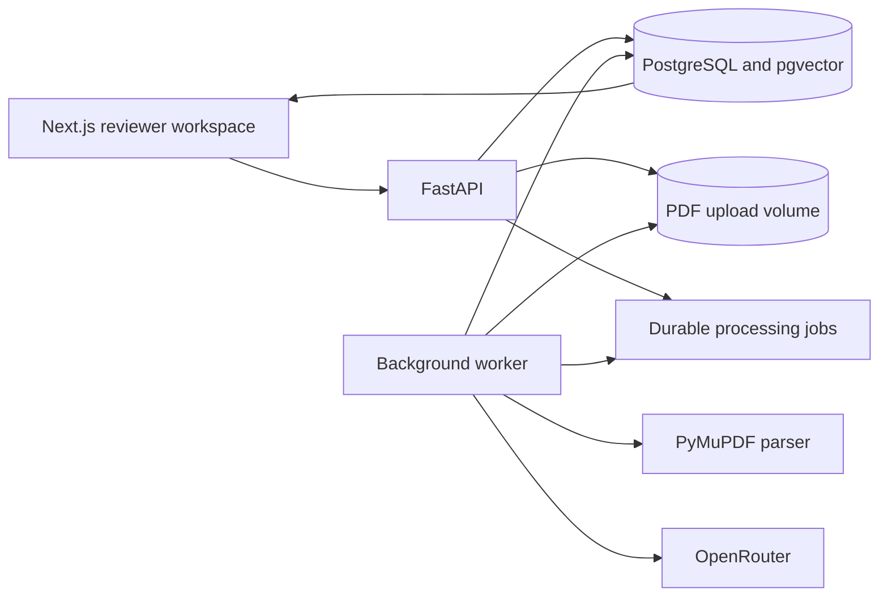

# Facts Store

Facts Store converts PDF documents into an auditable, project-scoped knowledge layer. It extracts
structured facts, attaches each fact to exact source evidence, normalizes values and context, and
compares claims across documents.

This is not a generic document chatbot. The central abstraction is a grounded fact that can be
inspected, normalized, compared, and explained.

```text
PDFs -> page elements -> evidence -> grounded facts -> normalization
     -> vector candidates -> relationship classification -> review
```

## What the system demonstrates

- Exact evidence grounding with document, page, quote, source element, and bounding-box metadata
- Typed fact extraction through OpenRouter structured outputs
- Deterministic validation before extracted claims enter the knowledge layer
- Unit, value, scope, claim-type, and Indian fiscal-period normalization
- Project-isolated semantic retrieval with PostgreSQL and pgvector
- Rules-first comparison with model-assisted adjudication only for ambiguous pairs
- Asynchronous PDF processing with durable progress, events, retries, and checkpoints
- A reviewer workspace for inspecting documents, facts, evidence, relationships, and failures

The relationship layer distinguishes four important outcomes:

| Relationship | Meaning |
| --- | --- |
| `CORROBORATES` | Two independently grounded facts express materially the same claim. |
| `CONTRADICTS` | Comparable facts disagree without a contextual explanation. |
| `RECONCILABLE` | Values differ because period, scope, unit, definition, or estimate vintage differs. |
| `RELATED` | Facts are semantically connected but do not support direct agreement testing. |

`NOT_COMPARABLE` is used internally to prevent weak candidates from becoming misleading
relationships.

## Architecture



The API accepts uploads and returns immediately with a job identifier. A separate worker claims
jobs using `FOR UPDATE SKIP LOCKED`, renews a lease while processing, and persists an append-only
event trace. The frontend polls job state without holding an upload request open.

### Processing lifecycle

```text
QUEUED
  -> PARSING
  -> BUILDING_EVIDENCE
  -> EXTRACTING_FACTS
  -> NORMALIZING
  -> INDEXING
  -> COMPARING
  -> COMPLETE
```

Extraction and embedding checkpoints allow failed jobs to resume without repeating completed model
work.

## Technology

| Area | Implementation |
| --- | --- |
| Reviewer workspace | Next.js, React, TypeScript, shadcn/ui, Tailwind CSS |
| API | FastAPI, Pydantic, SQLAlchemy asyncio |
| Worker | Independent Python process backed by PostgreSQL jobs |
| PDF parsing | PyMuPDF with page elements and normalized bounding boxes |
| Structured inference | OpenRouter chat completions with strict JSON Schema |
| Embeddings | OpenRouter embeddings API |
| Storage and retrieval | PostgreSQL 16, pgvector, HNSW cosine index |
| Local orchestration | Docker Compose |

## Repository layout

```text
.
├── apps
│   ├── api
│   │   ├── app
│   │   │   ├── api          # HTTP routes
│   │   │   ├── core         # configuration and lifecycle enums
│   │   │   ├── llm          # provider contract and OpenRouter adapter
│   │   │   └── pipeline     # parsing, grounding, normalization, and comparison
│   │   └── tests
│   └── web
│       └── src              # reviewer workspace and API client
└── docker-compose.yml
```

## Getting started

### Requirements

- Docker with Docker Compose
- An OpenRouter API key
- An OpenRouter text model that supports structured outputs
- An OpenRouter embedding model compatible with the configured vector dimensions

### Configuration

Create a local environment file from the checked-in template:

```bash
cp apps/api/.env.example .env
```

Set these values in `.env`:

```dotenv
OPENROUTER_API_KEY=your-key
OPENROUTER_TEXT_MODEL=provider/text-model
OPENROUTER_EMBEDDING_MODEL=provider/embedding-model
EMBEDDING_DIMENSIONS=384
```

The embedding model must return exactly `EMBEDDING_DIMENSIONS` values. This dimension is also used
by the PostgreSQL vector column and should be chosen before ingesting documents.

Useful optional controls:

| Variable | Default | Purpose |
| --- | ---: | --- |
| `FACT_EXTRACTION_PAGE_BATCH_SIZE` | `4` | PDF pages included in each extraction request |
| `FACT_EXTRACTION_CONCURRENCY` | `3` | Concurrent extraction requests per document |
| `FACTS_PER_PAGE_LIMIT` | `8` | Maximum requested facts per page |
| `EMBEDDING_BATCH_SIZE` | `90` | Facts included in each embedding request |
| `EMBEDDING_ITEMS_PER_MINUTE` | `90` | Client-side embedding pacing; `0` disables it |
| `MAX_LLM_RELATIONSHIPS_PER_DOCUMENT` | `12` | Maximum model fallback comparisons per document |
| `OPENROUTER_TIMEOUT_MS` | `60000` | Request timeout |
| `OPENROUTER_RETRY_ATTEMPTS` | `3` | Retries for transient provider failures |

All available settings are documented in [`apps/api/.env.example`](apps/api/.env.example).

### Run the stack

```bash
docker compose up --build
```

| Service | Address |
| --- | --- |
| Reviewer workspace | <http://localhost:3000> |
| OpenAPI documentation | <http://localhost:8001/docs> |
| API health check | <http://localhost:8001/api/v1/health> |
| PostgreSQL | `localhost:5433` |

To stop the stack without deleting database or upload volumes:

```bash
docker compose down
```

## Basic API workflow

Create an isolated project:

```bash
curl -X POST http://localhost:8001/api/v1/projects \
  -H 'Content-Type: application/json' \
  -d '{"name":"India Macroeconomy"}'
```

Upload a PDF using the returned project ID:

```bash
curl -F 'file=@/absolute/path/report.pdf' \
  http://localhost:8001/api/v1/projects/PROJECT_ID/documents
```

The upload response contains `document.id` and `job.id`. Poll the job independently:

```bash
curl http://localhost:8001/api/v1/jobs/JOB_ID
```

Inspect project-wide facts and relationships:

```bash
curl 'http://localhost:8001/api/v1/projects/PROJECT_ID/facts?limit=500'

curl 'http://localhost:8001/api/v1/relationships?project_id=PROJECT_ID'
```

## Data model

The database is the knowledge layer, not merely a cache for model output.

| Entity | Responsibility |
| --- | --- |
| Project | Isolates documents, facts, retrieval, and relationships into one context. |
| Document | Stores upload identity, SHA-256 hash, status, and parser metadata. |
| Page and element | Preserve reading order, text, dimensions, and physical location. |
| Evidence | Stores an exact quote and its page, element IDs, bounding boxes, and table context. |
| Fact | Retains both raw and normalized subject, predicate, value, unit, period, and scope. |
| Relationship | Stores classification, confidence, explanation, differences, and candidate score. |
| Job and event | Provide durable asynchronous state, progress, failures, and audit history. |

Facts are accepted only when the evidence identifier exists and the supporting quote and raw value
can be verified against the extracted source text. Model confidence never bypasses this check.

## Comparison strategy

1. Normalize the fact without discarding its original representation.
2. Generate an embedding and retrieve nearby facts only from previously processed documents in the
   same project.
3. Apply deterministic checks for subject, predicate, numeric tolerance, unit, period, scope, claim
   type, and estimate vintage.
4. Use the configured text model only when a high-similarity pair remains ambiguous.
5. Persist the decision, explanation, differences, confidence, and classifier version.

Embeddings discover candidates; they never determine whether a claim is true or contradictory.

## Reviewer workspace

The web application provides:

- Project creation and selection
- Multi-document PDF upload and asynchronous progress tracking
- Project-wide and document-specific fact views
- Exact evidence quotes linked back to the source PDF and page
- Relationship filtering for corroboration, contradiction, and reconciliation
- Failure review with processing events and retry support
- Light and dark themes

## Assignment evaluation cases

The supplied Delhivery and India macroeconomy documents support the required demonstrations without
filename-specific rules:

- **Corroboration:** equivalent financial or macroeconomic values expressed with different wording
  or units
- **Contradiction:** comparable forecasts or reported values that materially disagree
- **Reconciliation:** apparent disagreement explained by period, reporting scope, unit, definition,
  or estimate vintage
- **Failure analysis:** chart labels, reading order, or table structure that native PDF text alone
  cannot reliably interpret

The failure case is intentional: the prototype exposes uncertain and failed behavior instead of
hiding it behind a fluent answer.

## Verification

Run the backend checks:

```bash
cd apps/api
uv sync --group dev
uv run ruff check .
uv run pytest
```

Run the frontend checks:

```bash
cd apps/web
pnpm install
pnpm lint
pnpm build
```

The backend tests cover PDF parsing, exact grounding, normalization, rules-first comparison, strict
OpenRouter payloads, embedding ordering, and vector-dimension validation.

## Current limitations

- Native PDF text is supported; OCR and scanned-document extraction are not yet implemented.
- Tables and charts are represented through extracted text blocks rather than a dedicated visual
  understanding model.
- Entity and predicate canonicalization is conservative and would benefit from a reviewed ontology.
- Schema bootstrap currently uses additive SQLAlchemy creation. Production deployment should use
  versioned migrations.
- Processing throughput and cost depend on the selected OpenRouter models and account limits.
- Relationships are generated incrementally against existing documents, so comparison coverage can
  depend on ingestion order until a project-wide recomputation job is added.

For backend implementation details and the full polling contract, see
[`apps/api/README.md`](apps/api/README.md).
